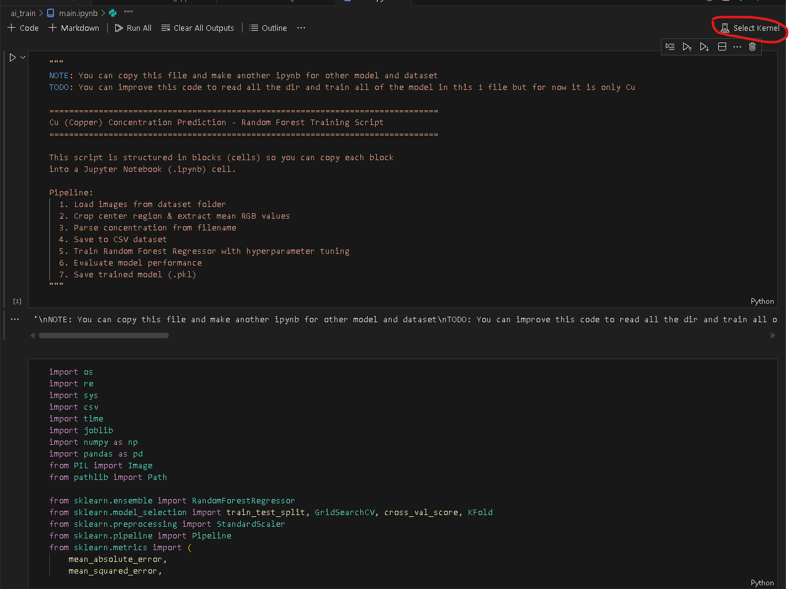

# Tutor AI Farmasi - AI Training Workspace

This workspace is dedicated to the research, development, and training of machine learning models for analyzing chemical samples.

## Directory Structure

- **`dataset/`**: Raw images used for training and testing.
- **`csv_dataset/`**: Extracted RGB values and calculated concentrations in CSV format.
- **`model/`**: Serialized model files (`.pkl`) ready for production.
- **`utils/`**: Helper functions for image processing and statistical analysis.
- **`main.ipynb`**: Primary training notebook (Random Forest model development).
- **`predict.ipynb`**: Evaluation and testing notebook for model performance analysis.

## Setup

This project uses [uv](https://github.com/astral-sh/uv) for fast and reliable Python package management.

### 1. Installation

Synchronize the dependencies and create a virtual environment:

```bash
uv sync
```

### 2. Select the Python Kernel

After synchronizing, you must select the correct Python kernel in your Jupyter environment. Choose the one from the `.venv` directory created by `uv`.



### 3. Training the Model

1. Ensure the `dataset/` directory contains the necessary training images.
2. Open `main.ipynb` in your Jupyter environment.
3. Run the cells to process images, extract features, and train the Random Forest model.
4. The trained model will be saved in the `model/` directory.

### 4. Evaluating Model Performance

1. Open `predict.ipynb`.
2. Run the notebook to evaluate the model against a test set and visualize the prediction accuracy using error metrics (Absolute Error, Percentage Error).

## Technology Stack

- **Python**: Core programming language.
- **Scikit-learn**: Machine learning framework for Random Forest.
- **Pandas & NumPy**: Data manipulation and numerical computations.
- **Pillow**: Image processing and feature extraction.
- **Matplotlib**: Performance visualization and error analysis.